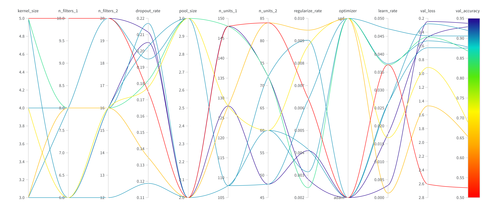

# Malaria Detection with Deep Learning using TensorFlow

This repository contains the code and documentation for an end-to-end deep learning project to classify malaria-infected cells from microscope slide images. The project utilizes a custom Convolutional Neural Network (CNN) built with TensorFlow and Keras, with a strong focus on modern MLOps practices like experiment tracking and hyperparameter optimization.

## Project Highlights

- **Custom CNN Architecture:** A custom, LeNet-inspired CNN was designed and implemented, incorporating modern deep learning techniques such as Batch Normalization, Dropout, Data Augmentation pipeline.
- **High-Performance Data Pipeline:** The entire data loading and preprocessing pipeline was built using `tf.data`, ensuring high efficiency and performance during training.
- **Systematic Hyperparameter Tuning:** Leveraged **Weights & Biases (W&B) Sweeps** to systematically search for the optimal set of hyperparameters, moving beyond manual tuning to a more rigorous, data-driven approach.
- **Rigorous Model Evaluation:** Models were selected based not just on peak accuracy but on training stability and validation loss, ensuring the final model is both robust and high-performing. The final model achieved **~93% validation accuracy**.

## Technologies Used

- **Frameworks:** TensorFlow, Keras
- **Libraries:** Weights & Biases (for experiment tracking), NumPy, Matplotlib, Scikit-learn
- **Dataset:** NIH Malaria Cell Image Dataset

